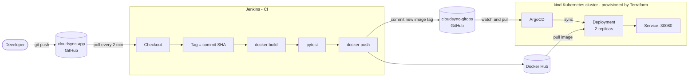
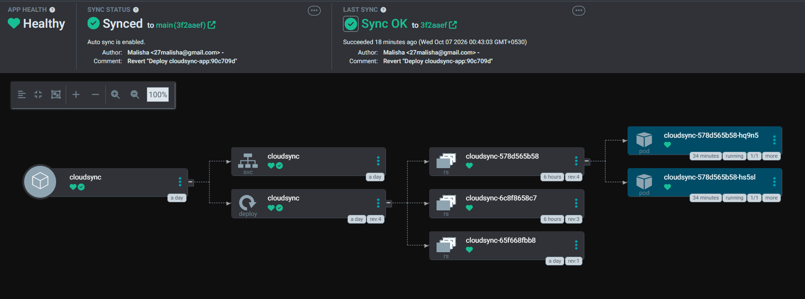
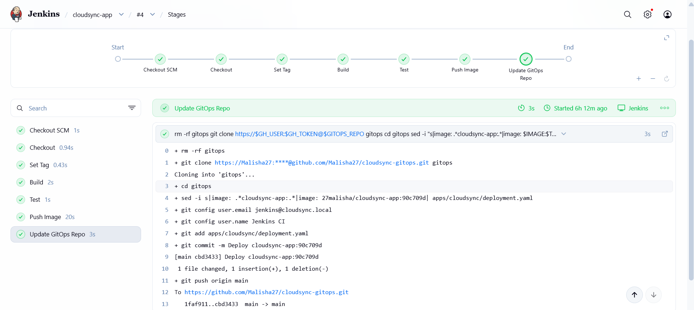
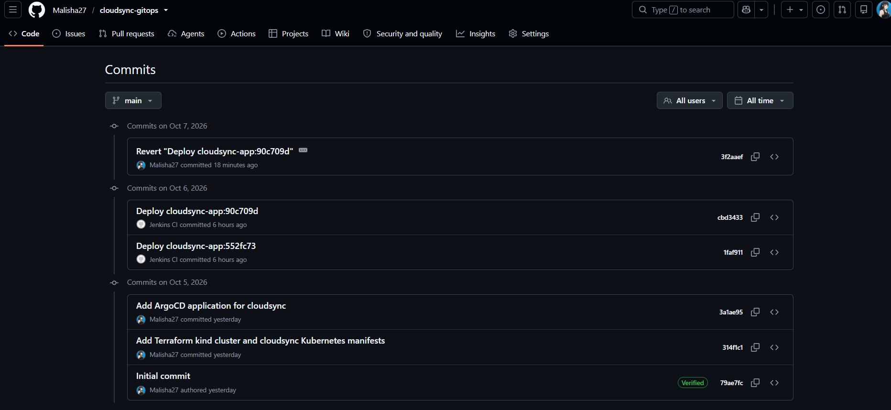
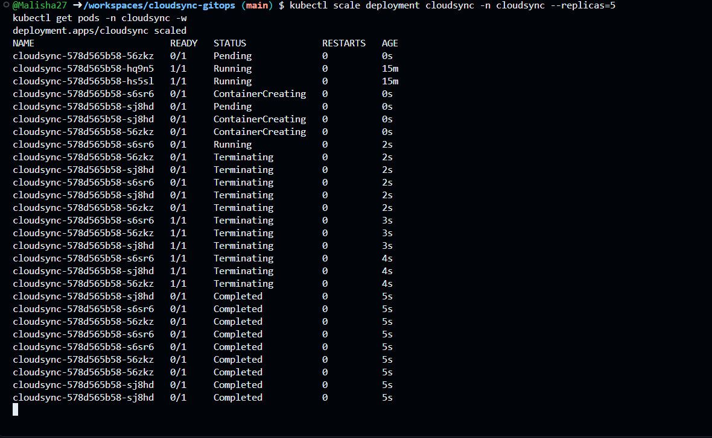
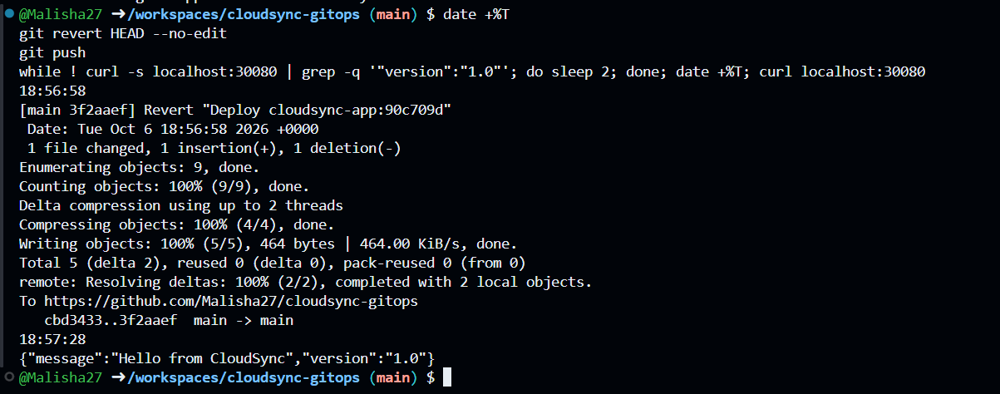
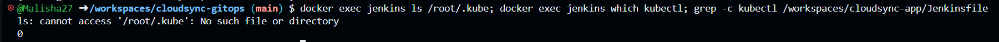

# CloudSync GitOps - Kubernetes CI/CD Pipeline

A pull-based GitOps delivery pipeline for Kubernetes. **Jenkins builds and commits. ArgoCD deploys. Git is the only way to change the cluster.**


> App code lives in [cloudsync-app](https://github.com/Malisha27/cloudsync-app). This repo is the **single source of truth** for what runs in the cluster.

---

## The Problem

Many teams deploy to Kubernetes with **push-based** CI/CD: the CI server runs `kubectl apply` directly against the cluster. That causes:

| Problem | Impact |
|---|---|
| **Config drift** | Manual `kubectl` fixes during incidents make the cluster differ from Git. Nobody knows the true state. |
| **Credential exposure** | The CI server must hold cluster-admin credentials. Compromise CI, compromise the cluster. |
| **Slow rollback** | Rolling back means re-running an old pipeline (~10 min) exactly when time matters most. |
| **No audit trail** | Direct cluster changes leave no record of who changed what, or why. |

## The Solution

Make Git the single source of truth. Jenkins never touches the cluster. It only builds the image and commits the new tag to this repo. **ArgoCD runs inside the cluster, pulls the desired state from Git, and continuously reconciles it**, reverting any drift.



**Key design choice:** there is no arrow from Jenkins to the cluster.

## Results (measured)

| Metric | Push-based | CloudSync GitOps |
|---|---|---|
| Rollback time | ~10 min (re-run pipeline) | **30 s** via `git revert` |
| Drift (manual `kubectl scale`) | Persists silently | **Auto-reverted in ~1 s** |
| Cluster credentials in CI | Yes (kubeconfig) | **None** |
| Code push to live | Manual steps | **~3-4 min, zero manual commands** |
| Audit trail | Pipeline logs | **Every deploy is a Git commit** |

## Tech Stack

| Tool | Role | Why this one |
|---|---|---|
| **Python Flask** | Sample app (`/`, `/health`) | Small, keeps focus on the pipeline |
| **Docker** | Containerize the app | Industry standard |
| **Docker Hub** | Image registry | Free, no cloud IAM setup |
| **kind** | Local multi-node Kubernetes (1 control plane + 2 workers) | Free, real multi-node cluster |
| **Terraform** (`tehcyx/kind`) | Provision the cluster as code | Reproducible, declarative, state-tracked |
| **Jenkins** | CI: test, build, push, bump tag | Widely used in enterprise |
| **ArgoCD** | CD: GitOps sync with `selfHeal` + `prune` | Kubernetes-native, visual UI |
| **GitHub Codespaces** | Cloud dev environment (4-core, 16 GB) | Zero load on my laptop |

## How It Works

1. Push code to `cloudsync-app`.
2. Jenkins (Poll SCM) runs the pipeline: **Checkout → Tag (short commit SHA) → Build → Test → Push Image → Update GitOps Repo**.
3. The last stage updates `image:` in [`apps/cloudsync/deployment.yaml`](apps/cloudsync/deployment.yaml) and commits it as `Jenkins CI`.
4. ArgoCD detects the new commit and performs a rolling update (readiness probe gated, zero downtime).
5. Any manual change in the cluster is reverted by ArgoCD `selfHeal`.

## Repository Layout

```
cloudsync-gitops/
├── terraform/main.tf              # kind cluster: 1 control plane + 2 workers, port 30080
├── apps/cloudsync/
│   ├── deployment.yaml            # 2 replicas, probes, resource limits (image tag bumped by Jenkins)
│   └── service.yaml               # NodePort 30080 -> 5000
├── argocd/application.yaml        # ArgoCD app: automated sync, prune, selfHeal
└── docs/                          # screenshots
```

## Proof

### ArgoCD - Synced and Healthy


### Jenkins pipeline - all stages green


### GitOps repo - deploys committed by Jenkins CI


### Drift self-heal - scaled to 5, back to 2 in ~1 s


### Rollback - `git revert` to previous version live in 30 s


### Security - no kubeconfig or kubectl in Jenkins


## Run It Yourself

```bash
# 1. Cluster
cd terraform && terraform init && terraform apply
kind export kubeconfig --name cloudsync

# 2. ArgoCD
kubectl create namespace argocd
kubectl apply -n argocd --server-side --force-conflicts \
  -f https://raw.githubusercontent.com/argoproj/argo-cd/stable/manifests/install.yaml

# 3. Register the app (one-time bootstrap; everything after goes through Git)
kubectl apply -f argocd/application.yaml

# 4. Verify
kubectl get pods -n cloudsync
curl localhost:30080
```

Jenkins setup (custom image with Docker CLI, credentials `dockerhub-creds` and `github-creds`, pipeline from SCM) is in [cloudsync-app](https://github.com/Malisha27/cloudsync-app).

## Challenges I Solved

- **ArgoCD pods stuck in `ImagePullBackOff`:** traced from `kubectl describe` (DNS timeout) to raw egress tests (`curl` to an IP returned `000`), then to an `iptables` legacy vs nft backend mismatch blocking the kind bridge. Fixed with NAT masquerade and FORWARD rules.
- **Worker nodes `NotReady` after restart:** kubelet logs showed it could not resolve `cloudsync-control-plane` because node DNS had been pointed at a public resolver. Fixed via `/etc/hosts` and a kubelet restart. Lesson: empty Service endpoints usually mean no ready pods, so check nodes first.
- **Pipeline failing at the GitOps push:** distinguished `Invalid username or token` (garbled credential) from `403` (valid token, missing permission). Fixed the fine-grained token scope (Contents: Read and write) and the stored credential.
- **Near-miss secret leak:** `git status` caught a kubeconfig generated by the Terraform provider before it was pushed. Added it to `.gitignore`.

## Next Steps

- Kustomize overlays for dev / prod
- Trivy image scanning stage in Jenkins
- Sealed Secrets or External Secrets for secret management
- Prometheus + Grafana monitoring
- Move to AWS EKS with Terraform, webhooks instead of polling

---

**Malisha Gavali** - [LinkedIn](https://linkedin.com/in/malisha) · [GitHub](https://github.com/Malisha27)